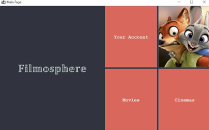
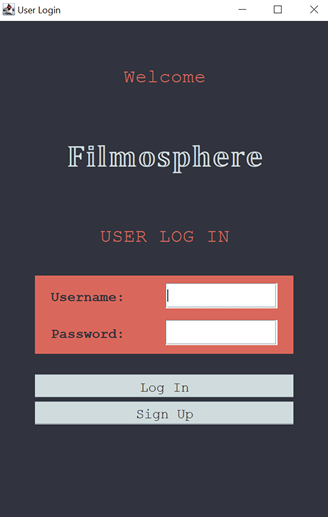
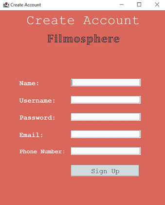
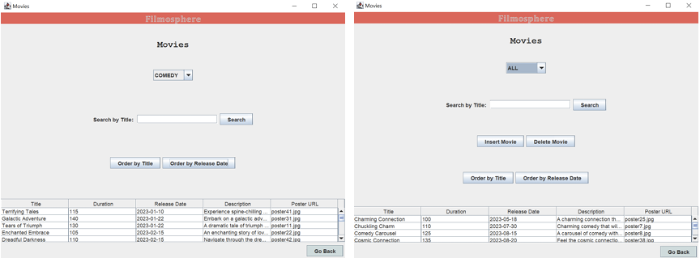
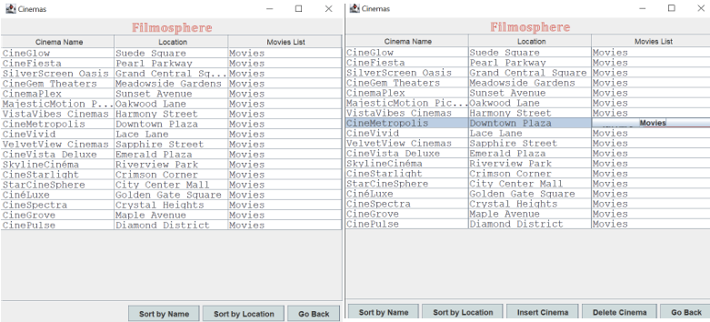

# 🎬 Filmosphere 

### 🎟️**A Movie Discovery and Management Platform** 🎟️

**Filmosphere** is an **OOP-based application** that  revolves around providing an immersive 
and engaging environment for movie enthusiasts.\
Built using the Model-View-Controller (MVC) architecture, it ensures modular, maintainable, and scalable code by clearly separating data, logic, and UI components.🦊🐰

<p align="center">
  
</p>

---

## 🌟 **Features**
### 🎭 **User Functionality**
-  **Movie Exploration**: Browse movies by genre.
-  **Cinema Showcase**: Explore cinemas and view their exclusive movie lineup. 
-  **User Account**: Personalized profiles information about the user's account.
### 🍿 **Admin Features**
-  **Manage Movies**: Insert & delete movies from the database.
-  **Cinema Management**: Add or remove cinemas.
-  **Role-based Access Control**: Admins have exclusive access to movie and cinema modifications.

---

## 🎥 **Tech Stack**
| **Component**  | **Technology Used** |
|---------------|-------------------|
| **Frontend** | Java Swing (GUI) |
| **Backend** | Java (OOP, MVC Architecture) |
| **Database** | MySQL (JDBC Integration,SQL Queries) |
| **Security** | Input validation, Admin authentication |

---
## 🔥 **Database & SQL Queries**
Filmosphere leverages **SQL queries** to manage movie and cinema data efficiently. The repository classes interact with the **MySQL database** using **JDBC** to:
- 📍 **Retrieve all cinemas and their associated movies** using `SELECT` queries.
- 🎬 **Fetch movies for a specific cinema** dynamically.
- ✍ **Insert, update, and delete cinema/movie records** through **prepared statements**.
- ⚡ **Optimize performance** with **indexed queries** and efficient joins.


---

## 🐰 Login & Signup Page
 Securely log in or create a new account with input validation.

| LogIn | HomePage |
| --- | --- |
|  |   |

---
## 🦊 Movies Page Overview
The Movies page offers an interactive experience for users to explore and manage movie details.

🌟 **Key Features:** 
- Header: Stylish label with genre selection.
- Search: Find movies by title with real-time updates.
- Sorting: Order movies by title or release date.
-  Movie Table: Displays Title, Duration, Release Date, Description, and Poster.
- Navigation: "Go Back" button for easy return.
  
👤**User & Admin Roles:**
Users: Browse and interact with movie details.
Admins: Manage the movie database with:
➕ Insert Movie – Add new movies via a dialog.
❌ Delete Movie – Remove multiple movies at once.



---

## 🎭 Cinemas Page Overview
The Cinemas page offers a detailed view of cinemas and their functionalities.

**🌟 Key Features:**
- Sorting Options: Arrange cinemas by name or location.
- Cinema Table: Displays Name, Location, and Movies List.
- Explore Movies: Click the "Movies" button to view a cinema's movie lineup.
- Navigation: "Go Back" button for easy return.
  
**👤 User & Admin Roles:**
Users: Browse and sort cinemas by name or location.
Admins: Manage the cinema database with:
➕ Insert Cinema – Add new cinemas via a dialog.
❌ Delete Cinema – Remove multiple cinemas at once.



---

## 🎥 **How to Run**
1. 📥 **Clone the Repository**
   ```bash
   git clone  https://github.com/ralucaand03/Filmosphere---OOP---Java.git
   cd filmosphere
2. 🛠 Setup the Database
Import database.sql into MySQL.
3. Run the Application
Open Filmosphere.java and run the main() function.

---

## 🚀 Future Enhancements
- Multilingual Support
-  Mobile App Version
- AI-based Movie Recommendations


---

🌟 If you like this project, leave a star! ⭐⭐⭐
